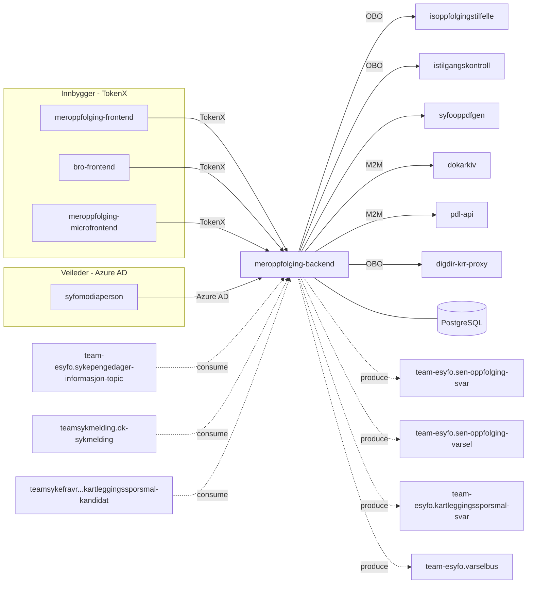

# Meroppfølging backendapp

[](https://github.com/navikt/meroppfolging-backend/actions/workflows/build-and-deploy.yaml)


Backend for [meroppfolging-frontend](https://github.com/navikt/meroppfolging-frontend), [bro-frontend](https://github.com/navikt/bro-frontend), [meroppfolging-microfrontend](https://github.com/navikt/meroppfolging-microfrontend) og [syfomodiaperson](https://github.com/navikt/syfomodiaperson). Håndterer sen oppfølging av sykmeldte, kartleggingsspørsmål og varsling.

## Formålet av appen

Appen betjener to hovedmålgrupper:

- **Sykmeldte** — besvarer spørsmål om behov for mer oppfølging fra Nav (sen oppfølging), fyller ut kartleggingsskjema, og får status om sykmelding og mikrofrontend-visning.
- **Veiledere (Nav-ansatte)** — henter skjema-besvarelser og kartleggingssvar for oppfølging av sykmeldte via [syfomodiaperson](https://github.com/navikt/syfomodiaperson).

Appen mottar sykmeldinger og sykepengedager-informasjon via Kafka, og publiserer svar, varsler og kartleggingsdata videre til andre tjenester.

## Arkitektur



## API

### Innbygger-API (TokenX)

#### Sen oppfølging (meroppfolging-frontend)

Status og innsending av svar for sykmeldte som har fått varsel om sen oppfølging.

- **GET** `/api/v2/senoppfolging/status`
- **POST** `/api/v2/senoppfolging/submitform`

#### Kartlegging (bro-frontend)

Innsending av kartleggingssvar og kandidat-status for sykmeldte som er kandidat for kartlegging.

- **POST** `/api/v1/kartleggingssporsmal`
- **GET** `/api/v1/kartleggingssporsmal/kandidat-status`

#### Sykmelding (meroppfolging-frontend)

Sjekk om bruker er i et aktivt oppfølgingstilfelle.

- **GET** `/api/v1/sykmelding/sykmeldt`

#### Mikrofrontend (meroppfolging-microfrontend)

Status for visning av meroppfølging-mikrofrontend på Min side.

- **GET** `/api/mikrofrontend/v1/status`

### Veileder-API (Azure AD)

#### Sen oppfølging (syfomodiaperson)

Hent skjemabesvarelse for en gitt person.

- **GET** `/api/v2/internad/senoppfolging/formresponse`

#### Kartlegging (syfomodiaperson)

Hent kartleggingssvar for en gitt person.

- **GET** `/api/v1/internad/kartleggingssporsmal/{uuid}`
- **GET** `/api/v1/internad/kartleggingssporsmal/kandidat/{kandidatId}/svar`

## Kafka

### Konsumerer

| Topic                                                         | Beskrivelse                               |
| ------------------------------------------------------------- | ----------------------------------------- |
| `teamsykmelding.ok-sykmelding`                                | Godkjente sykmeldinger                    |
| `team-esyfo.sykepengedager-informasjon-topic`                 | Informasjon om gjenstående sykepengedager |
| `teamsykefravr.ismeroppfolging-kartleggingssporsmal-kandidat` | Kandidater for kartleggingsspørsmål       |

### Produserer

| Topic                                  | Beskrivelse                            |
| -------------------------------------- | -------------------------------------- |
| `team-esyfo.sen-oppfolging-svar`       | Svar fra sykmeldte om oppfølgingsbehov |
| `team-esyfo.sen-oppfolging-varsel`     | Varsler om sen oppfølging              |
| `team-esyfo.kartleggingssporsmal-svar` | Svar på kartleggingsspørsmål           |
| `team-esyfo.varselbus`                 | Varsel-hendelser (esyfovarsel)         |

## Utvikling

Prosjektet bruker [mise](https://mise.jdx.dev/) for oppgaveautomatisering:

```bash
mise install            # Installer verktøy
mise tasks              # Vis tilgjengelige oppgaver
```

## For Nav-ansatte

Interne henvendelser kan sendes via Slack til **team-esyfo** i kanalen [#esyfo](https://nav-it.slack.com/archives/esyfo).
