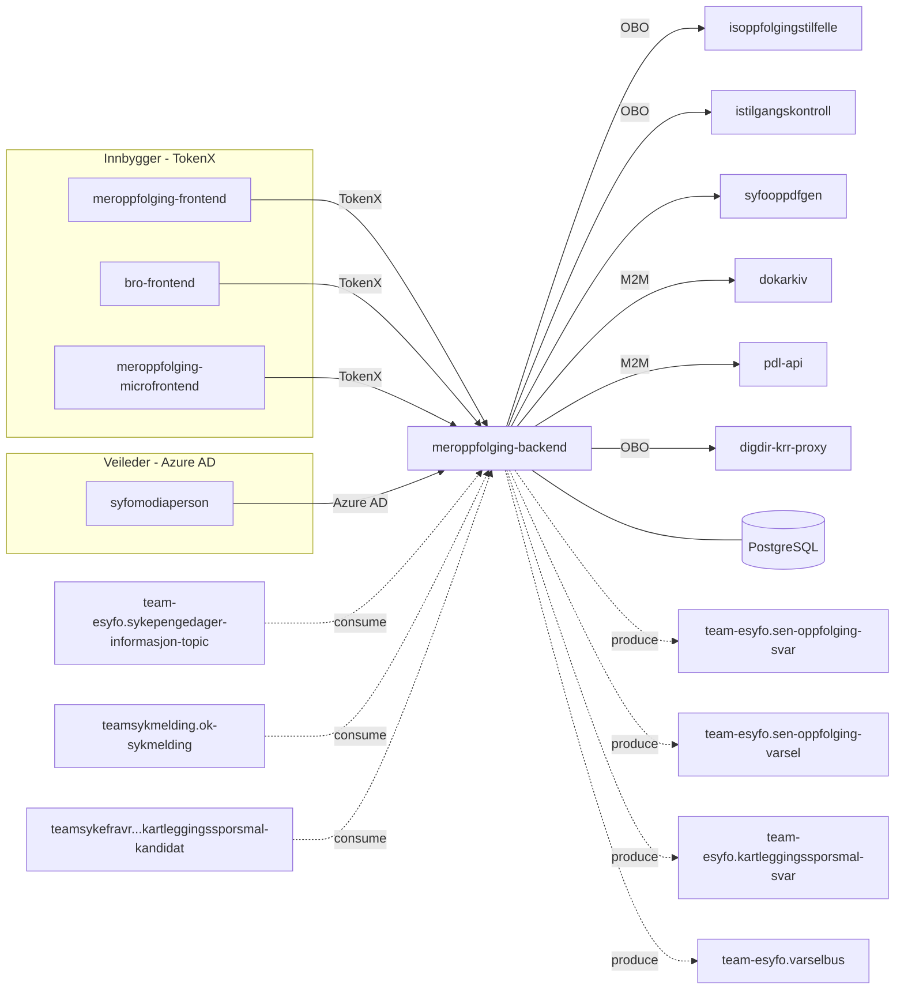

# Meroppfølging Backend

[](https://github.com/navikt/meroppfolging-backend/actions/workflows/build-and-deploy.yaml)


Backend for [meroppfolging-frontend](https://github.com/navikt/meroppfolging-frontend) og [bro-frontend](https://github.com/navikt/bro-frontend). Håndterer sen oppfølging av sykmeldte, kartleggingsspørsmål og varsling.

## Formål

Appen betjener to hovedmålgrupper:

- **Sykmeldte** — besvarer spørsmål om behov for mer oppfølging fra Nav (sen oppfølging), fyller ut kartleggingsskjema, og får status om sykmelding og mikrofrontend-visning.
- **Veiledere (Nav-ansatte)** — henter skjema-besvarelser og kartleggingssvar for oppfølging av sykmeldte via [syfomodiaperson](https://github.com/navikt/syfomodiaperson).

Appen mottar sykmeldinger og sykepengedager-informasjon via Kafka, og publiserer svar, varsler og kartleggingsdata videre til andre tjenester.

## Arkitektur



## API

### Innbygger-API (TokenX)

| Metode | Sti | Beskrivelse |
|--------|-----|-------------|
| GET | `/api/v2/senoppfolging/status` | Hent status for sen oppfølging |
| POST | `/api/v2/senoppfolging/submitform` | Send inn svar på sen oppfølging |
| POST | `/api/v1/kartleggingssporsmal` | Send inn kartleggingsspørsmål-svar |
| GET | `/api/v1/kartleggingssporsmal/kandidat-status` | Hent kandidat-status for kartlegging |
| GET | `/api/v1/sykmelding/sykmeldt` | Sjekk om bruker er sykmeldt |
| GET | `/api/mikrofrontend/v1/status` | Hent status for mikrofrontend-visning |

### Veileder-API (Azure AD)

| Metode | Sti | Beskrivelse |
|--------|-----|-------------|
| GET | `/api/v2/internad/senoppfolging/formresponse` | Hent skjemabesvarelse for person |
| GET | `/api/v1/internad/kartleggingssporsmal/{uuid}` | Hent kartleggingsspørsmål |

## Kafka

### Konsumerer

| Topic | Beskrivelse |
|-------|-------------|
| `teamsykmelding.ok-sykmelding` | Godkjente sykmeldinger |
| `team-esyfo.sykepengedager-informasjon-topic` | Informasjon om gjenstående sykepengedager |
| `teamsykefravr.ismeroppfolging-kartleggingssporsmal-kandidat` | Kandidater for kartleggingsspørsmål |

### Produserer

| Topic | Beskrivelse |
|-------|-------------|
| `team-esyfo.sen-oppfolging-svar` | Svar fra sykmeldte om oppfølgingsbehov |
| `team-esyfo.sen-oppfolging-varsel` | Varsler om sen oppfølging |
| `team-esyfo.kartleggingssporsmal-svar` | Svar på kartleggingsspørsmål |
| `team-esyfo.varselbus` | Varsel-hendelser (esyfovarsel) |

## Utvikling

### Forutsetninger

- Java 21
- Docker (for lokal database, Kafka og auth-server)

### Utviklerverktøy (mise)

Prosjektet bruker [mise](https://mise.jdx.dev/) for oppgaveautomatisering:

```bash
mise install            # Installer verktøy
mise tasks              # Vis tilgjengelige oppgaver
```

| Oppgave | Kommando | Beskrivelse |
|---------|----------|-------------|
| docker-up | `mise docker-up` | Start PostgreSQL, Kafka og auth-server |
| docker-down | `mise docker-down` | Stopp Docker-tjenester |
| build | `mise build` | Bygg med Gradle |
| start | `mise start` | Kjør appen lokalt |
| test | `mise test` | Kjør tester |
| lint | `mise lint` | Sjekk kodeformatering (Ktlint) |
| format | `mise format` | Formater kode (Ktlint) |

### Kjør lokalt

```bash
mise docker-up && mise start
```

Eller i IntelliJ: legg til profilene `docker` og `local` i run configuration.

### Bygg og test

```bash
./gradlew build     # Bygg + test + lint
./gradlew test      # Kun tester
```

### Kodeformatering

Vi bruker **Ktlint** (`intellij_idea`-stil). Installer Ktlint-pluginen i IntelliJ og aktiver «Format on Save», eller kjør:

```bash
./gradlew ktlintFormat
```

### Kjøre tester med Rancher Desktop

Last ned og installer [Rancher Desktop](https://rancherdesktop.io/). Testene bruker Testcontainers og krever en Docker-kompatibel runtime.

<details>
<summary>Feilsøking for Mac</summary>

Hvis testene feiler med «Could not find a valid docker environment»:

```bash
sudo ln -s $HOME/.rd/docker.sock /var/run/docker.sock
```

</details>

## For Nav-ansatte

Interne henvendelser kan sendes via Slack i kanalen [#esyfo](https://nav-it.slack.com/archives/esyfo).

Teamet: **team-esyfo**
